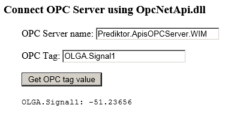

# OPC-DA-ASPNET-Client
Connect to an OPC Server using the OpcNetApi.dll API

Project is an ASP.NET website created with Visual Studio Express 2012 for Web. Use the *.sln to open the project.

Screenshot:

